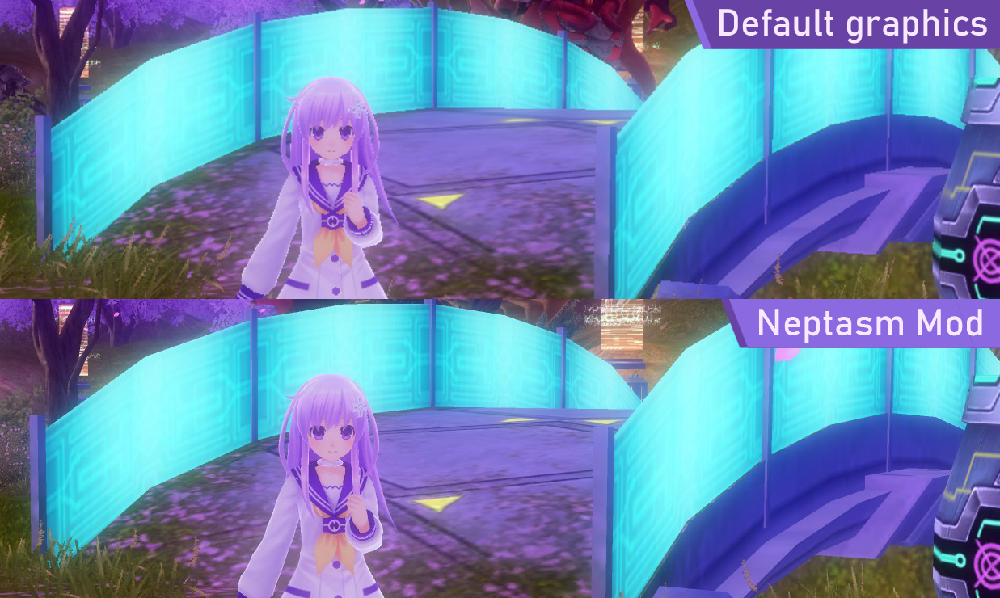
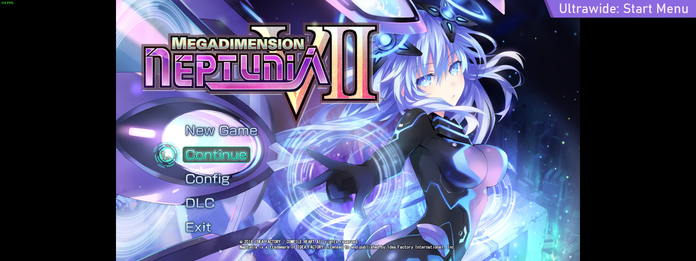
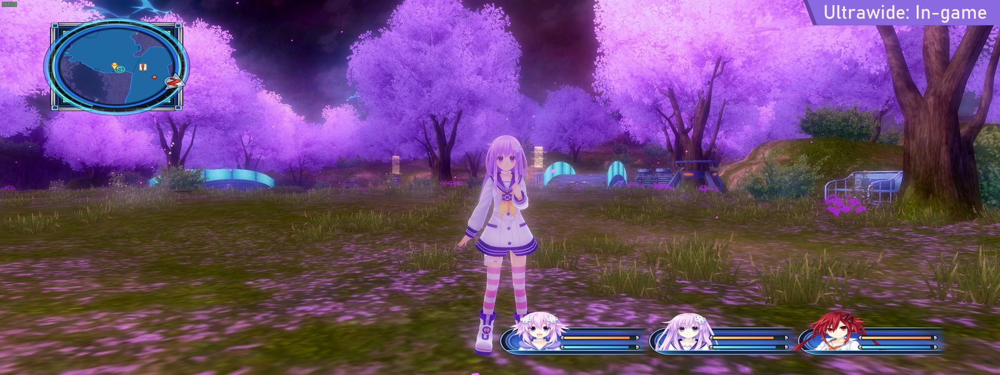

# Neptasm Mod
Graphical improvements mod for Megadimension Neptunia VII.

## Features:
- FPS Unlock
- Camera angles unlock
- Resolution upscaling and downscaling
- Fitting resolution to the window size (Base game always renders at 1080p)
- Full window size control
- Partial ultrawide support (3D view renders properly, UI is stretched horizontally)
- Smol (3.35 KB)
- Nep Nep

## In short:

## Install:
 1. Download the latest .zip file from [Releases](https://github.com/tlaik/neptasm/releases/)
 2. Extract both files inside - dinput8.dll and nep.ini - into the game's base folder.
     - You can find the game folder by right-clicking on your Nep game in Steam library, choosing "Properties", going to "Installed Files" tab and clicking "Browse".

Steam guide is also available [here](https://steamcommunity.com/sharedfiles/filedetails/?id=3008103481)!

## Configure:
 Default configuration already provides all the improvements, including unlocked framerate, camera angles and 2.0x resolution. Default screen/window size is 1920x1080.\
 If you wish to tune it yourself - open the nep.ini file with any text editor. If needed, right-click on it and go to "Open With".\
 All the options have self-explanatory names, mirroring the list of features, and have comments explaining their effect and suggested values.

## Ultrawide examples:

## Notes:
Tested only with the Steam version. GoG might or might not be supported - feel free to find it out yourself and report back.\
If you wish to partake in the delightful misery of editing the source code, use build.cmd along with [UASM](https://www.terraspace.co.uk/uasm.html) assembler and polink from [MASM32](https://masm32.com).

Comments in [d3dctx.asm](https://github.com/tlaik/neptasm/blob/main/src/d3dctx.asm) outline standing issues with fixing ultrawide UI stretch (if you ever feel like your life lacks pain and torment)

## Credits:
 - [MegaresolutionNeptunia](https://github.com/AterialDawn/MegaresolutionNeptunia) - Research into controlling the game resolution.
 - [KingKrouch](http://steamcommunity.com/profiles/76561198065895896) - Help with FPS unlock & ultrawide support.